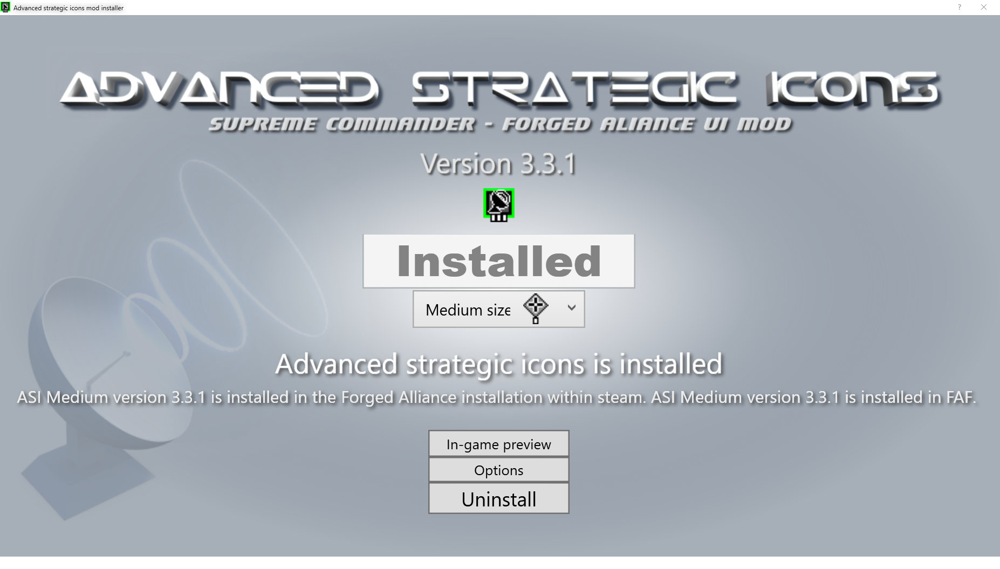

First you need to install Advanced Strategic Icons mod installer 3.3.1.exe

select which size you would like to have. WQHD resolution works fine with medium setting

Once it is installed it places a file at this location:

**c:\Program Files (x86)\Steam\steamapps\common\Supreme Commander Forged Alliance\gamedata\Advanced strategic icons.scd**

Back in the days the content of the file was automatically loaded, but this has been disabled.

The workaround is the following.

Using 7-zip or another compression tool copy the content of the file:

**c:\Program Files (x86)\Steam\steamapps\common\Supreme Commander Forged Alliance\gamedata\Advanced strategic icons.scd**

inside the file (both files are basically zip files):

**c:\Program Files (x86)\Steam\steamapps\common\Supreme Commander Forged Alliance\gamedata\textures.scd**

You need to **overwrite** the files.

Make sure to make a **backup** of **textures.scd** in case you ever wish to go back to the vanilla icons.

After this the Advanced Strategic Icons are now your default icons in the game.

Do this on your own risk!
